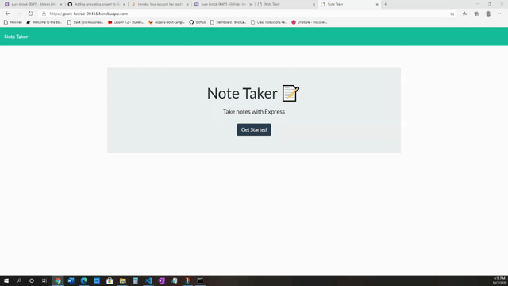

# Note Taker


## Description

Create an application that can be used to write, save, and delete notes. This application will use an express backend and save and retrieve note data from a JSON file.

## Note Taker Demo



### Deploying the App

https://pure-brook-00455.herokuapp.com/

---

## Installation

To install necessary dependencies, run the following command:

```
npm i
```

## License

This project is licensed under the MIT license.
